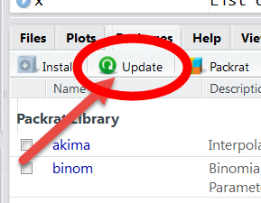

USGSHydroTools
============

Installation
------------

See [https://github.com/USGS-R/dataRetrieval](https://github.com/USGS-R/dataRetrieval) for information on the dependent package dataRetrieval

Windows user can install the package dependencies using the following command:
```r
install.packagtes(c("rgdal","rgeos","sp","dataRetrieval","raster"))
```

Mac users will have to work a little harder to install the dependent packages rgdal and rgeos. The latest instructions are:
```r
setRepositories(ind = c(1,6))
install.packages(c("rgdal","rgeos","sp","dataRetrieval","raster"))
```	

##Package Installation
To install the `USGSHydroTools` package:

1. Install R (version 3.0 or greater) from: [https://cran.r-project.org/](https://cran.r-project.org/)

2. Install RStudio from: [https://www.rstudio.com/products/rstudio/download/](https://www.rstudio.com/products/rstudio/download/)

3. Add the USGS R repository to your "Rprofile" to get automatic updates. Run the following code:
  
  ```r
  rprofile_path = file.path(Sys.getenv("HOME"), ".Rprofile")
  write('\noptions(repos=c(getOption(\'repos\'),
    CRAN=\'https://cloud.r-project.org\',
    USGS=\'https://owi.usgs.gov/R\'))\n',
      rprofile_path, 
      append =  TRUE)

  cat('Your Rprofile has been updated to include GRAN.
    Please restart R for changes to take effect.')
  ```

4. Restart R!

5. In the RStudio "Console" window (usually left or lower-left), run the following command:

  ```r
  install.packages("USGSHydroTools")
  ```
  

6. Update often. Next time you update your packages, `USGSHydroTools` will automatically update:

   

7. Make sure to keep your version of R up-to-date. CRAN and the USGS repository will only update packages for the most recent version of R, and one version behind that.


Disclaimer
----------
This software is in the public domain because it contains materials that originally came from the United States Geological Survey, an agency of the United States Department of Interior. For more information, see the official USGS copyright policy at [http://www.usgs.gov/visual-id/credit_usgs.html#copyright](http://www.usgs.gov/visual-id/credit_usgs.html#copyright)

Although this software program has been used by the U.S. Geological Survey (USGS), no warranty, expressed or implied, is made by the USGS or the U.S. Government as to the accuracy and functioning of the program and related program material nor shall the fact of distribution constitute any such warranty, and no responsibility is assumed by the USGS in connection therewith.

This software is provided "AS IS."

[
    
  ](http://creativecommons.org/publicdomain/zero/1.0/)
